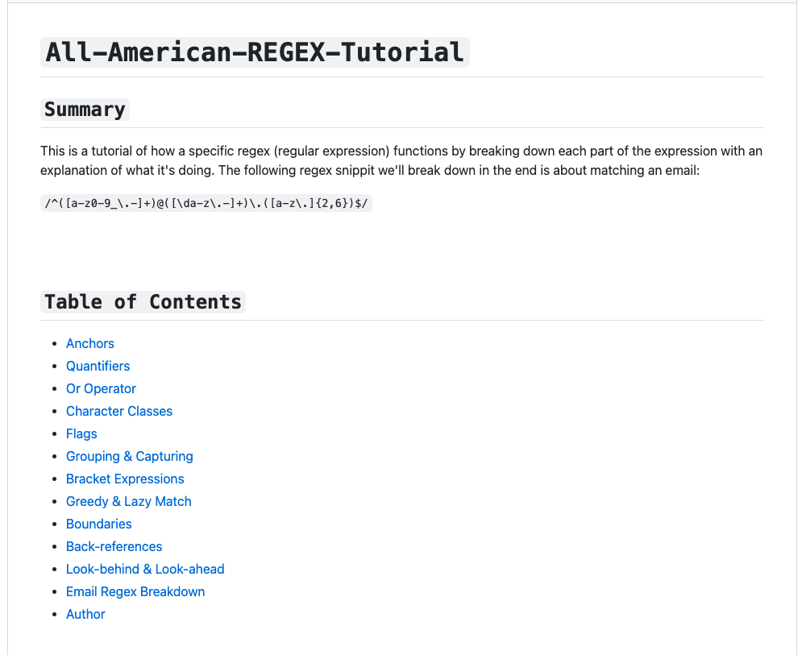

# **``All-American-REGEX-Tutorial``**
[Link to the regex tutorial](https://gist.github.com/MrBrandtCox/46013867667218b62f3ac32bb76ec953#file-all-american-regex-tutorial-md)
  

## **``Description``**
This is a tutorial of how a specific regex (regular expression) functions by breaking down each part of the expression with an explanation of what it's doing.
  

## **``User Story``**
**AS A** web development student  
**I WANT** a tutorial explaining a specific regex  
**SO THAT I** can understand the search pattern the regex defines.
  

## **``Acceptance Criteria``**
* GIVEN a regex tutorial  
**1.** WHEN I open the tutorial  
THEN I see a descriptive title and introductory paragraph explaining the purpose of the tutorial, a summary describing the regex featured in 
the tutorial, a table of contents linking to different sections that break down each component of the regex and explain what it does, and a
section about the author with a link to the author’s GitHub profile  
**2.** WHEN I click on the links in the table of contents  
THEN I am taken to the corresponding sections of the tutorial  
**3.** WHEN I read through each section of the tutorial  
THEN I find a detailed explanation of what a specific component of the regex does  
**4.** WHEN I reach the end of the tutorial  
THEN I find a section about the author and a link to the author’s GitHub profile 

## **``Mock-Up``**

## **``License``**
[MIT](https://github.com/MrBrandtCox/All-American-REGEX-Tutorial/blob/main/LICENSE)